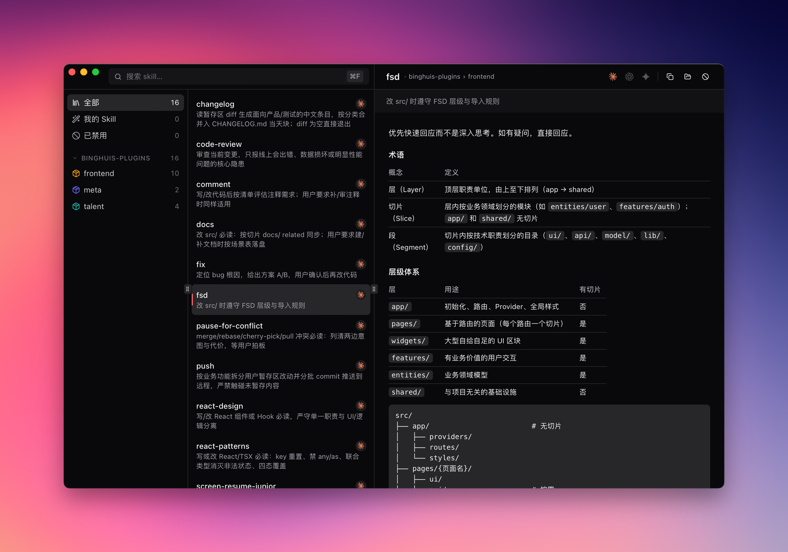

# Quiver

跨 Claude / Codex / Gemini 的 skill 分发台。你在自己的 IDE 里写 `SKILL.md`，Quiver 负责装、分发、启停、查看、清理——**只管不写**。



## Features

- **跨生态同步**：写在 Claude 里的 skill 一键复制给 Codex / Gemini；多端漂移后一键拉齐
- **统一启停**：改 `SKILL.md` ↔ `SKILL.md.disabled`，同时写 Claude 插件级开关
- **GitHub 导入**：粘 URL 当 marketplace 拉下来，里面所有 skill 自动入库，可一键 `git pull` 刷新
- **冲突检测**：同生态同名 ≥2 份时红色置顶，避免 agent 调用时随机命中
- **统一入口**：扫 `~/.claude/skills`、`~/.codex/skills`、`~/.gemini/skills` 合并展示，按生态 / 插件 / 标签筛

## 安装（macOS）

去 [Releases](https://github.com/binghuis/quiver/releases) 下载对应架构的 dmg：

- Apple Silicon（M1/M2/M3/M4）→ `Quiver_*_aarch64.dmg`
- Intel Mac → `Quiver_*_x64.dmg`

首次打开如提示「已损坏，无法打开」，终端执行一次即可：

```bash
xattr -cr /Applications/Quiver.app
```

> 应用未做 Apple 公证（开源项目常规做法），介意可以 `git clone` 后自己 `pnpm tauri build`。

## 开发

```bash
pnpm install
pnpm tauri dev
pnpm tauri build
```
